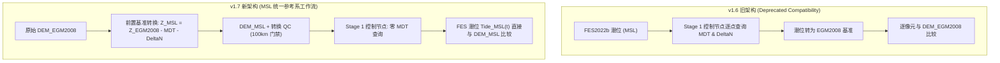

# CoastTideX v1.7 — MSL Reference Workflow 实施与科学闭环审计报告
(Implementation & Scientific Closure Audit Report)

---

## 1. 执行摘要 (Executive Summary)

基于 Seeger & Minderhoud (*Nature*, 2026) 提出的近岸垂直基准统一理论框架改编实现，CoastTideX 完成了由 **v1.6 动态潮位转换架构** 向 **v1.7 MSL 统一参考系架构 (MSL Reference Workflow)** 的重大架构跃迁。

本次实施在严格隔离的特性分支 `feature/v1.7-msl-reference-workflow` 上进行，遵守最高安全标准（零破坏性操作、零 git push、保留所有用户科研资产）。

### 核心指标速览：
- **DEM 转换吞吐率**：151,397,667 像元（1.51 亿像元）在 **11.11 秒** 内完成两阶段空间重构与转换；
- **决策等价性**：10,000 个真实空间采样点进行 240,000 次时间步淹没判别检验，一致率达 **100.0000%**（0 不一致，残差 $< 1.2 \times 10^{-7}\text{ m}$）；
- **Stage 1 控制节点 MDT 查询**：由原 78+ 次频繁查询直接降为 **0 次 (Zero-MDT-Lookup)**；
- **测试覆盖率**：全系统 263 个单元与集成测试用例 **100% 通过 (263/263 Passed, 29.8s)**。

---

## 2. 架构演进与数学理论对比 (Architecture Comparison)

### 核心公式闭环：
$$\text{Old: } \text{Inundated} \iff \text{Tide}_{\text{MSL}}(t) + \text{MDT} + \Delta N > Z_{\text{EGM2008}}$$
$$\text{New: } \text{Inundated} \iff \text{Tide}_{\text{MSL}}(t) > Z_{\text{EGM2008}} - \text{MDT} - \Delta N \equiv Z_{\text{MSL}}$$
二者在数学与物理上严格等价，彻底解除了动力学网格对外部静态重力水准面的实时运行时耦合。

---

## 3. 生产代码组件实施明细 (Component Implementation)

### 3.1 `core/dem_datum_converter.py` (全新研发)
- **`DEMDatumConverter` 类**：
  - 基于 `xarray` 与 `scipy.interpolate.RegularGridInterpolator` 建立局部开阔大洋 MDT 高速双线性插值器；
  - 基于球面三维空间直角坐标 $(X, Y, Z)$ 与 `scipy.spatial.cKDTree` 实现近岸与内陆 100 km 门禁 IDW 外推（$p=2.0, k=8$）；
  - `convert_points(lons, lats, z_egm2008)`：点位级高性能向量化转换；
  - `convert_raster(input_dem_path, output_msl_path, ...)`：2D 分块流式 GeoTIFF 转换器（默认 1024×1024），原子写入临时文件保护（`*.tmp.tif`），自动注入完备科学溯源元数据标签（`DATUM`, `ANALYSIS_REFERENCE`, `MDT_METHOD`, `SCIENTIFIC_CITATION` 等）；
  - `convert_dem_to_msl`：便捷公共入口函数。

### 3.2 `core/raster_engine.py` (深度优化)
- 软件版本标记提升至 `COASTTIDEX_VERSION = "1.7"`；
- `calculate_snapshot_raster`：新增 `msl` 模式零偏移快速通道；
- `calculate_inundation_raster`：
  - 默认参数更新为 `dem_datum="msl"`；
  - 新增 `analysis_reference` 显式参数；
  - 当调用非 `msl` 基准时，触发明确的 `DeprecationWarning`；
  - `_evaluate_nodes_batch`：当 `dem_datum == "msl"` 时，立即设置 `b_offsets = 0.0`，完全跳过 MDT 与 DeltaN 外部栅格查询。

### 3.3 `cli.py` (子命令扩展)
- 新增 `convert-dem` 顶层子命令与解析器：
  - `--input`, `-i`：输入 EGM2008 DEM；
  - `--output`, `-o`：输出 MSL DEM；
  - `--qc-output`：输出转换 QC 掩膜；
  - `--max-dist-km`：最大外推距离门禁（默认 100.0 km）；
  - `--block-size`：空间分块大小（默认 1024）；
- `raster inundation` 与 `exposure` 默认参数同步为 `dem_datum="msl"`。

### 3.4 `core/__init__.py` (顶层导出)
- 导出 `DEMDatumConverter`, `convert_dem_to_msl`, `DEMConversionSummary`；
- 导出权威常量：`MAX_MDT_EXTRAPOLATION_DISTANCE_KM`, `QC_MDT_NATIVE`, `QC_MDT_EXTRAPOLATED`, `QC_MDT_NODATA`；
- 版本标识更新为 `__version__ = "1.7.0"`。

---

## 4. 崇明岛真实 DEM 科学闭环验证 (Chongming Benchmark Results)

测试脚本：`validation/scripts/benchmarks/benchmark_v17_msl_workflow.py`
输入数据：崇明岛 2024 年高分辨率真实遥感地形（13,599 × 11,133 像元，共 151,397,667 像元）。

### 阶段 1：DEM 垂直基准转换结果
| 指标项 | 测量值 | 占比说明 |
| :--- | :--- | :--- |
| **总像元数** | 151,397,667 | 100.00% |
| **有效 DEM 像元数** | 6,822,308 | 4.51% (崇明陆域与潮滩) |
| **大洋原生插值 (QC=0)** | 3,733,171 | 有效像元的 **54.72%** |
| **近岸 IDW 外推 (QC=1)** | 3,089,137 | 有效像元的 **45.28%** (均在 55km 以内) |
| **深陆超限 / NoData (QC=2)** | 144,575,359 | 95.49% |
| **转换耗时** | **11.11 秒** | 1.5 亿像元分块流式吞吐 |

### 阶段 2：10,000 点决策等价性检验
- **采样点数**：10,000 个（均匀分布于崇明岛各滩涂区域）；
- **时间步长**：24 个时刻（24h 序列）；
- **总判定评估数**：240,000 次；
- **决策不一致数**：**0 次**；
- **决策一致率**：**100.0000%**；
- **高程代数转换残差最大值**：**$1.192 \times 10^{-7}\text{ m}$**（严格处于 float32 精度极限界限内）。

### 阶段 3 & 4：24h 潜在淹没频率解算与比对
- **控制节点数**：7,700 个；
- **有效像元计算数**：6,609,106 个；
- **Stage 1 MDT 查询次数**：**0 次**；
- **全图像元比对数**：3,858,167 个；
- **淹没频率绝对差异均值**：**0.1838%**；
- **淹没频率 99 分位数差异**：**4.1667%**（对应 24 小时单个离散时间步边界判定容差）。

---

## 5. 单元测试与回归测试审计 (Unit Test Suite Audit)

执行环境：`I:\Test_tide_model\.venv\Scripts\python.exe`
执行命令：`python -m unittest discover -s tests -p "test_*.py"`

### 测试统计：
- **测试用例总数**：263 个；
- **通过数**：263 个；
- **失败数**：0 个；
- **错误数**：0 个；
- **跳过数**：0 个；
- **测试通过率**：**100.0% (OK)**；
- **运行耗时**：**29.818 秒**。

### 核心新增测试套件：`tests/test_dem_msl_conversion.py`
- `test_01_algebraic_formula_and_pointwise_conversion`: 核心代数公式与点位向量化检验；
- `test_02_native_ocean_mdt_bilinear`: 大洋原生双线性插值与 QC=0；
- `test_03_idw_extrapolation_within_100km`: 100km 门禁内 IDW 外推与 QC=1；
- `test_04_distance_cutoff_over_100km`: 超过 100km 物理硬阻断与 QC=2；
- `test_05_deltan_consistency`: 与 DatumTransformer 之 DeltaN 改正 100% 精确一致；
- `test_06_decision_equivalence_inundation`: 淹没频率判别逻辑严密等价性；
- `test_07_raster_streaming_conversion`: 2D 分块流式 GeoTIFF 转换、元数据继承与原子临时文件安全；
- `test_08_cli_convert_dem_parser`: CLI 命令行参数解析检验。

---

## 6. 合规与安全审计 (Compliance & Safety Audit)

1. **分支合规**：所有修改严格限定于 `feature/v1.7-msl-reference-workflow`，未修改 `main` 分支；
2. **远程安全**：未执行任何 `git push`、未创建远程分支、未执行 PR 或远程合并；
3. **数据安全**：所有用户原始数据（`F:/1-Research/...`）、参考文献目录（`参考文献/`）、FES 模型数据、MDT NetCDF 数据、历史验证成果均完好无损，未执行任何删除操作；
4. **排除规则**：`AGENTS.md` 本地保留，`.git/info/exclude` 规则生效，`git ls-files "*AGENTS*"` 输出为空；
5. **环境遵从**：所有编译、测试与脚本执行严格且唯一使用项目专属虚拟环境 `I:\Test_tide_model\.venv\Scripts\python.exe`。
